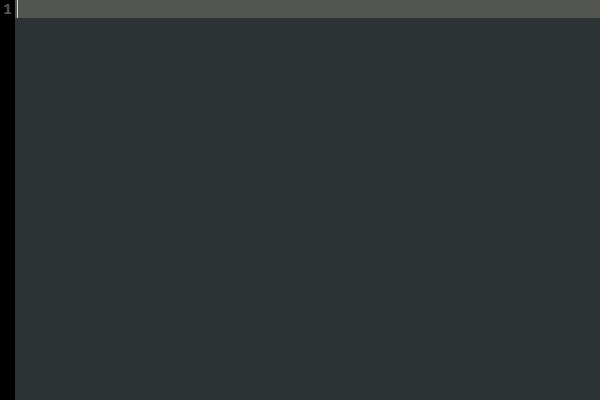
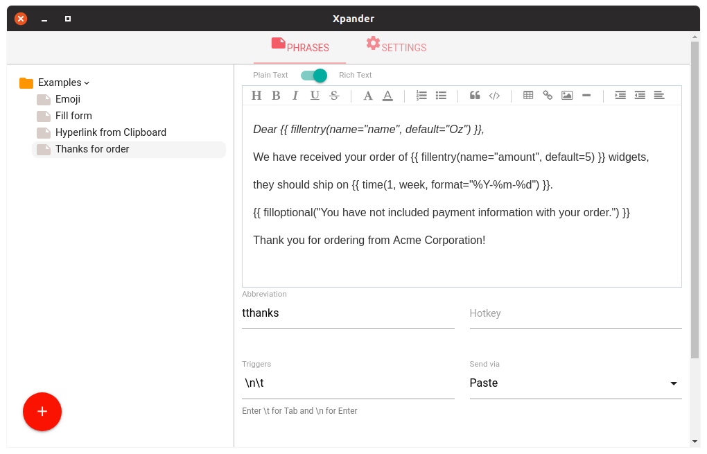
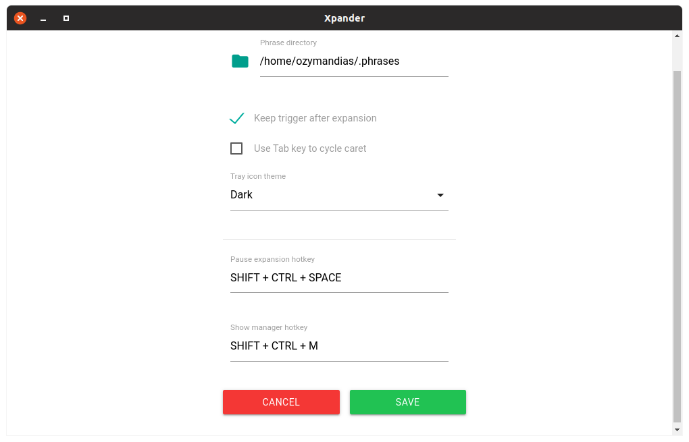
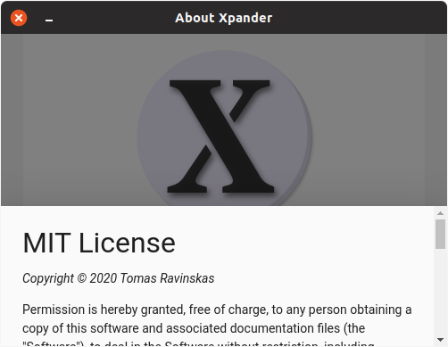

# Xpander

#### ARCHIVED

I haven't touched this project in a very long while and I no longer use it myself,
therefore I decided to archive this repository.

----------------------------------------------------------------------------------




A [Text Expander](https://textexpander.com/) inspired text expander and text macro appication for Windows and Linux.






## About

-------------------

If you find this software useful, [consider becoming a patron](https://www.patreon.com/ozymandias)

-------------------

Xpander is written python 3 and typescript. It runs on Windows and Linux, with possibility to port to more platforms.

You type an abbreviation and it's automatically expanded to (replaced with) a predefined block of text called a phrase.
Both plain text and richtext with formating are supported.
This is very useful when filling out forms, typing emails, coding or doing creative (yet repetetive) writing. Or any kind of writing, really.

Each phrase is stored as specially formatted JSON file.
By default they a placed in `~/.phrases` but you can change it in
settings.
Since these are small text files and Xpander is cross platform you can easily sync these between computers.

## Bugs

Of course there are bugs! Nothing major, just something to keep in mind while I
iron them out.

### Firefox

Firefox web browser has a ridiculously slow event loop, so when programatically
(like, *really* quickly) sending events, some get "swallowed" or dropped.

What this means in practice:

- When expanding a phrase sometimes one or two of the abbreviation characters get left behind.

### Windows

- Enabling caret cycling with `Tab` key in settings disables `Tab` key in most native applications.
This happens because sending events directly to active window is wonky on windows.
Usually you have to find active control and send the event directly to it instead.
- Fill-in-the-blank window gets pushed to the background on first showing requiring to `alt-Tab` to it.
This shouldn't happen when popping up a second, third, ... time.

## Features

Unlike some text expanders (I'm looking at you, [Autokey](https://github.com/autokey/autokey)), Xpander fully supports multiple keyboard layouts, meaning that when you change keyboard language
you won't accidentally trigger phrases.

Other features include:

- Rich text support with formatting. If using richtext phrase in plaintext editor, Xpander automatically removes formatting to prevent artefacts.
- Templating macros. Xpander uses [Jinja2](https://jinja.palletsprojects.com/) templating engine. Combined with other features this makes for a powerful and robust way to define phrases.
- Fill-in-the-blank fields in phrases. You can add information to your phrases at the time of expansion, with multiple field types, default values for when you don't need to change anything and linking of named fields (more below).
- Phrase embedding. You can use an already defined phrase as part of one or more bigger phrases.
- Clipboard (and mouse selection) embedding in phrases.
- Caret (cursor) repositioning after expansion. You can also define multiple caret insertion points and cycle between them with the tab key. Or if it causes issues with some applications, disable this feature in settings.
- Date and time formatting and math. With `time` function you can insert formatted dates, of current time, future or past.
- Command running. Run an application or a shell script and use it's output in a phrase.
- Key macros. With the `key` function you can send key presses and combinations to applications.
- Window filters. Define a filter by window class or title and the phrase will only expand in matching windows.
- And more!

## Installation

Xpander only needs system installation of python 3.6+ to run.
You can get it at [python.org/](https://www.python.org/).

Prebuilt packages of Xpander are available on [releases page](https://github.com/OzymandiasTheGreat/xpander/releases).

## Phrase syntax, functions and tokens

Phrase can be any text or in case of rich text any valid html.
Defining html directly can be done, but is currently not very well supported. You should use the build-in rich text editor.

No special syntaxt is necessary, how ever if you want advanced functionallity here's the docs!

### Syntax

Since Xpander uses [Jinja2](https://jinja.palletsprojects.com/) so you can get *very* advanced with phrase definitions.
For full description of Jinja2 syntax go [here](https://jinja.palletsprojects.com/en/2.11.x/templates/).

#### Functions

Jinja2 allows variable expansion and function calls from the template (phrase).
For the sake of consistency, Xpander doesn't define any variables
and uses functions for almost everything.
Note that function arguments need to be quoted (either `'` or `"`)
unless otherwise noted. This doesn't apply to numerals.

Function     | Arguments                            | Example                                     | Explanation
-------------|--------------------------------------|---------------------------------------------|----------------------
time         | period, unit, format                 | {{ time(-1, week, "%Y-%m-%d") }}            | Outputs date one week ago like 2020-01-13
time         | format                               | time(format="%B %d, %Y")                    | Ouputs current date like January 31, 2020
clipboard    | -                                    | {{ clipboard() }}                           | Inserts clipboard contents
primary      | -                                    | {{ primary() }}                             | Inserts mouse selection contents on Linux, doesn't do anything on Windows
key          | key                                  | {{ key("tab") }}                            | Sends a key press to the focused application
key          | key, state                           | {{ key("tab", "down") }}                    | Presses and holds/releases a key
phrase       | name                                 | {{ phrase("signature") }}                   | Inserts expanded phrase contents
run          | command                              | run("cowsay Hello, World!")                 | Runs a command and inserts it's output
run          | command, dir, shell, stderr          | run("echo Error", shell=True, stderr=False) |
fillentry    | name, default, width                 | fillentry("name", "Oz")                     | Displays a fill-in-the-blank dialog with single line text field
fillmulti    | name, default, width, height         | fillmulti()                                 | Displays a fill-in-the-blank dialog with multi line text field
fillchoice   | choice1, choice2, ..., name, default | fillchoice("red", "green", name="color", default="blue") | Displays a fill-in-the-blank dialog with multiple choice widget
filloptional | text, name                           | filloptional("This text will only output if you check the box!") | Displays a block of text with a checkbox to toggle inclusion

##### Time format tokens

These are the tokens you can use in `time` function.
For every posibillity check python's documentation on [`strftime`](https://docs.python.org/3/library/datetime.html#strftime-and-strptime-behavior).

Token | Meaning      | Example
------|--------------|---------
%a    | Weekday      | Sun, Mon
%A    | Weekday      | Sunday
%d    | Day of month | 31, 28
%b    | Month        | Jan, Feb
%B    | Month        | January
%y    | Year         | 99, 15
%Y    | Year         | 2020
%H    | Hour (24)    | 23, 12
%I    | Hour (12)    | 12, 9
%p    | PM or AM     |
%M    | Minute       | 59, 05
%S    | Second       | 45, 09
%%    | Percent sign | %

#### Tokens

Even though tokens provide addintional functionality they are not part of Jinja2 language.

Token | Meaning
------|---------
$\|   | Insert caret (cursor) at this point. Can be inserted multiple times
$+    | Override settings to keep trigger after expansion
$-    | Override settings to remove trigger after expansion

## Running from source and Packaging

I strongly recommend you install [poetry](https://python-poetry.org/) and [yarn](https://yarnpkg.com/) for python and node dependency management respectively.
You should also use [nvm](https://github.com/nvm-sh/nvm) to install latest LTS of node.

```sh
nvm install --lts --latest-npm
nvm use --lts
```

First clone this repo

```sh
git clone https://github.com/masaeedu/xpander.git
```

Then install dependencies

```sh
poetry install
```

or

```sh
pip install -r requirements.txt
```

And

```sh
yarn install
```

or

```sh
npm install
```

Then just run

```sh
yarn start
```

or

```sh
npm start
```

To package run

```sh
yarn build_py
yarn dist
```

or alternativly

```sh
npm buold_py
npm dist
```
